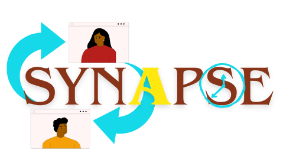
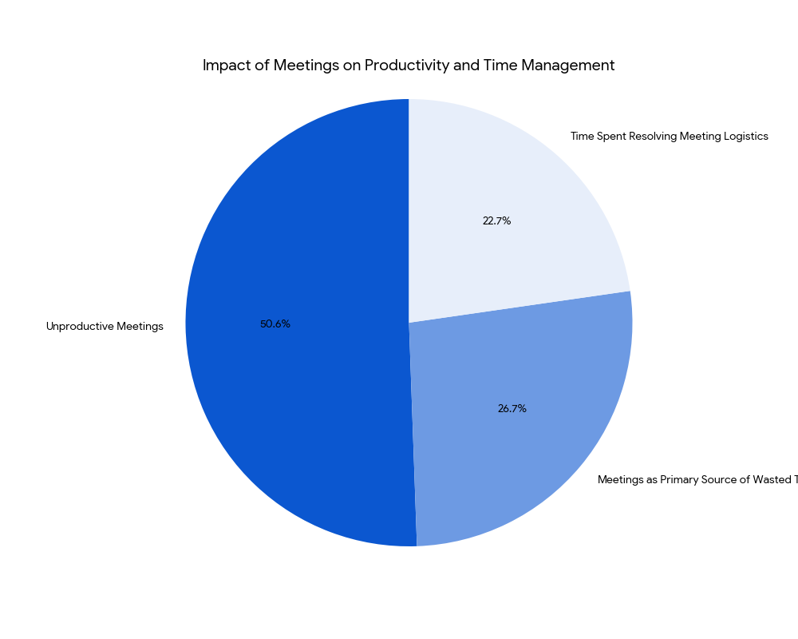

<div align="center">
  
</div>

# Synapse: AI-Powered Scheduling Assistant

<div align="center">
  
  
  
  
  
</div>

---

## 🎯 Overview

Synapse is an innovative AI-powered scheduling assistant designed to autonomously coordinate meetings, resolve conflicts, and optimize calendar schedules. Built for the **AMD AI Hackathon**, it leverages advanced Agentic AI to streamline workplace productivity by eliminating the inefficiencies of manual scheduling.

### The Problem

<div align="center">
  
</div>

Modern workplaces face significant challenges with meeting coordination:
- **55 million meetings** occur weekly in the U.S., yet only **11% are productive**.
- Employees waste **31 hours monthly** in unproductive meetings.
- **47% of workers** cite meetings as their primary source of wasted time.
- Organizations lose **$420,000 annually** on unproductive meetings.

### The Solution

Synapse tackles these challenges with:
- **Autonomous Scheduling**: Fully automated meeting coordination.
- **Conflict Resolution**: Intelligent handling of scheduling conflicts.
- **Natural Language Processing**: Conversational meeting requests via DeepSeek LLM.
- **Calendar Integration**: Seamless synchronization with Google Calendar.
- **Time Optimization**: Saves up to **31 hours per employee monthly**.

---

## ✨ Features

### Core Capabilities
- 🤖 **Autonomous Meeting Coordination**: End-to-end scheduling without manual intervention.
- 🧠 **Natural Language Processing**: Schedule meetings using conversational inputs.
- 📅 **Smart Conflict Resolution**: Automatically finds alternative time slots.
- 🔄 **Real-time Calendar Sync**: Seamless Google Calendar integration.
- ⚡ **Batch Processing**: Efficiently handles multiple attendees.
- 🎯 **Preference Learning**: Respects user time preferences (e.g., morning, afternoon).
- 🌐 **Multi-timezone Support**: Coordinates across different time zones.

### Technical Features
- **vLLM Server Integration**: Utilizes DeepSeek LLM for advanced language understanding.
- **Google Calendar API**: Full calendar access and event management.
- **Flask REST API**: Simple HTTP interface for easy integration.
- **Free/Busy Optimization**: Efficient availability checking.
- **Error Handling**: Robust mechanisms for error management and fallbacks.

---

## 🏗️ Architecture

```
┌────────────────────┐    ┌────────────────────┐    ┌────────────────────┐
│    User Input      │───▶│    Flask API       │───▶│    vLLM Server     │
│ (Natural Language) │    │    (Port 5000)     │    │ (DeepSeek LLM)     │
└────────────────────┘    └────────────────────┘    └────────────────────┘
                                 │
                                 ▼
                         ┌────────────────────┐
                         │     AI Agent       │
                         │  (Email Parser)    │
                         └────────────────────┘
                                 │
                                 ▼
                         ┌────────────────────┐
                         │ Google Calendar API│
                         └────────────────────┘
```

---

## 🚀 Quick Start

### Prerequisites
- Python 3.8 or higher
- Google Calendar API credentials
- vLLM server with DeepSeek LLM
- Required Python packages

### Installation

1. **Clone the Repository**
   ```bash
   git clone git@github.com:vinayak1729-web/synapse.git
   cd synapse
   ```

2. **Install Dependencies**
   ```bash
   pip install google_auth_oauthlib flask openai python-dateutil
   ```

3. **Set Up Google Calendar Credentials**
   - Create a Google Cloud project and enable the Calendar API.
   - Download credentials and place them in the `Keys/` directory.
   - File format: `userone.amd.json`, `userone.amd.token`.

4. **Start the vLLM Server**
   ```bash
   HIP_VISIBLE_DEVICES=0 vllm serve /path/to/deepseek-ai/deepseek-llm-7b-chat \
       --gpu-memory-utilization 0.9 \
       --swap-space 16 \
       --disable-log-requests \
       --dtype float16 \
       --max-model-len 2048 \
       --tensor-parallel-size 1 \
       --host 0.0.0.0 \
       --port 3000
   ```

5. **Run the Flask Server**
   ```bash
   python synapse.py
   ```

### Usage Example

Send a POST request to the `/receive` endpoint:

```json
{
  "Request_id": "6118b54f-907b-4451-8d48-dd13d76033a5",
  "Datetime": "02-07-2025T12:34:55",
  "Location": "IIT Mumbai",
  "From": "userone.amd@gmail.com",
  "Attendees": [
    {"email": "usertwo.amd@gmail.com"},
    {"email": "userthree.amd@gmail.com"}
  ],
  "EmailContent": "Hi team, let's meet on Thursday for 30 minutes to discuss the status of Agentic AI Project."
}
```

---

## 📊 Performance Metrics

The system tracks detailed metrics for optimization:

```json
{
  "MetaData": {
    "status": "success: event created",
    "attempted_days": 1,
    "preferred_time_honored": false,
    "conflicts_resolved": 1,
    "api_calls": 4,
    "llm_processing_time": 0.244898
  }
}
```

---

## 🔧 Configuration

### Environment Variables
- `GOOGLE_APPLICATION_CREDENTIALS`: Path to Google service account key.
- `VLLM_HOST`: vLLM server host (default: `localhost`).
- `VLLM_PORT`: vLLM server port (default: `3000`).
- `FLASK_PORT`: Flask server port (default: `5000`).

### Time Zone Configuration
- Currently supports **IST (Asia/Kolkata)**.
- Multi-timezone support planned for future releases.

---

## 🏆 Evaluation Criteria

Synapse excels in the following areas:
- ✅ **Correctness**: Accurate scheduling with robust conflict resolution.
- ⚡ **Latency**: Optimized API calls with sub-second response times.
- 📝 **Repository Maintenance**: Clean, well-documented codebase.
- 🎨 **Creativity**: Innovative use of NLP and autonomous scheduling.

---

## 📈 Impact & Benefits

### Productivity Gains
- Saves **31 hours/month** per employee.
- Reduces organizational costs by up to **$420,000 annually**.
- Minimizes scheduling conflicts with intelligent automation.
- Reduces stress through streamlined coordination.

### Technical Advantages
- **Natural Language Interface**: Eliminates complex forms or rigid inputs.
- **Autonomous Operation**: Requires minimal human intervention.
- **Scalable Architecture**: Handles multiple simultaneous requests.
- **Extensible Design**: Easily integrates with other calendar systems.

---

## 🔄 API Reference

### POST `/receive`
Processes meeting scheduling requests.

**Request Body:**
```json
{
  "Request_id": "string",
  "Datetime": "string",
  "Location": "string",
  "From": "email",
  "Attendees": [{"email": "string"}],
  "EmailContent": "string"
}
```

**Response:**
```json
{
  "Request_id": "string",
  "EventStart": "ISO datetime",
  "EventEnd": "ISO datetime",
  "Duration_mins": "string",
  "MetaData": {
    "status": "string",
    "conflicts_resolved": "number",
    "api_calls": "number"
  }
}
```

---

## 🚧 Roadmap

### Upcoming Features
- [ ] **Web UI Interface**: User-friendly graphical interface.
- [ ] **Multi-timezone Support**: Global scheduling capabilities.
- [ ] **Advanced Preference Learning**: ML-based preference optimization.
- [ ] **Integration Plugins**: Support for Slack, Teams, and Outlook.
- [ ] **Mobile Application**: iOS and Android apps.
- [ ] **Analytics Dashboard**: Insights into meeting productivity.

### Technical Improvements
- [ ] **Caching Layer**: Redis integration for enhanced performance.
- [ ] **Database Support**: PostgreSQL for data persistence.
- [ ] **Authentication System**: OAuth2 implementation.
- [ ] **Load Balancing**: Support for multi-instance deployments.

---

## 🤝 Contributing

We welcome contributions! Follow these steps to get started:

1. Fork the repository.
2. Create a feature branch (`git checkout -b feature/amazing-feature`).
3. Commit your changes (`git commit -m 'Add amazing feature'`).
4. Push to the branch (`git push origin feature/amazing-feature`).
5. Open a Pull Request.

### Development Setup
```bash
# Install development dependencies
pip install -r requirements-dev.txt

# Run tests
python -m pytest tests/

# Code formatting
black synapse.py
flake8 synapse.py
```

---

## 📄 License

This project is licensed under the [MIT License](LICENSE).

---

## 🙏 Acknowledgments

- **AMD AI Hackathon**: For providing the platform and inspiration.
- **DeepSeek AI**: For the powerful language model.
- **Google Calendar API**: For seamless calendar integration.
- **vLLM Team**: For the efficient inference server.

---

## 📞 Contact

- **Project Lead**: [Vinayak Shinde](mailto:vs8879785320@gmail.com)

---

<div align="center">
  <p><strong>Made with ❤️ for the AMD AI Hackathon</strong></p>
  <p>Transforming workplace productivity through AI-powered scheduling</p>
</div>

---
